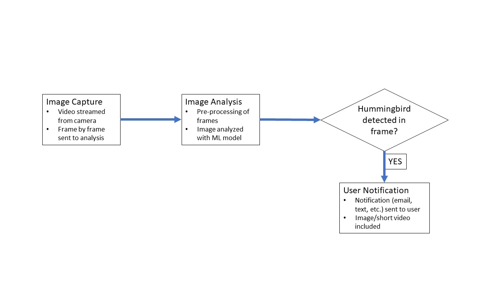

# hummingbird_detect

This project's goal is to identify hummingbirds when they show up on a camera feed and notify the user/client when one is currently within the camera's view.



# Table of Contents
* [Jetson Setup](#jetson-setup)
* [Project Iterations](#project-iterations)
* [Work Environment Setup](#work-environment-setup)
  * [VNC Setup](#vnc-setup)
  * [Media Streaming Setup](#media-streaming-setup)
* [Instructions](#instructions)

# Jetson Setup

Initially this was going to be set up on a Jetson Nano, initially running Jetpack 4.3.6. I have since migrated to using a Jetson Xavier running Jetpack 5.0.2. The following instructions and commands are helpful for updating Jetpack.
In order to update all parts of the Jetpack SDK to the latest supported on Nano, which is 4.6.1. This version includes Linux version 32.7.3.

To check jetpack version type:
```
sudo apt-cache show nvidia-jetpack
```

To check Linux version:
```
dpkg-query --show nvidia-l4t-core
```

To update jetpack, follow the following steps:

First, edit `etc/apt/sources.list.d/nvidia-l4t-apt-source.list` to point to the desired repo using your preferred editor (just change the version to r35.1 in both lines)
Then run:
```
sudo apt update
sudo apt dist-upgrade
```

# Project Iterations

The first phase of the project is to set up a hummingbird classifier trained on existing dataset images of hummingbirds, other birds, gardens, and squirrels, to cover common features of the eventual deployment location (a backyard).

The second phase of the project is to integrate the classifier with a livestream of a separate camera with an RTSP feed.

The third phase of the project is to gather custom data for object detection and train an object detection model, working with the live RTSP feed.

The fourth phase of the project is to create an alert system or GUI to interact with the output of the detection.

# Work Environment Setup
## VNC Setup
In order to work remotely, one of the tools I used was VNC. I chose VNC as a result of issues I had with X11 forwarding built into the Hello AI World system. VNC also enabled me to view and access photos and videos from Xavier. I used Xfce and TightVNC since they are lightweight and fast, ensuring the VNC connection is smooth and stable. I followed [this guide](https://www.digitalocean.com/community/tutorials/how-to-install-and-configure-vnc-on-ubuntu-20-04) for the installation and setup.

### Step 1: Installing Xfce environment and VNC Server
On the Xavier, run the following commands:
```
sudo apt update
sudo apt install xfce4 xfce4-goodies
```
This will install the Xfce desktop environment, I chose the default display manager when prompted.

Then, install the TightVNC server:
```
sudo apt install tightvncserver
```
Run the following command to set a VNC access password, create the initial config files, and start a VNC server instance:
```
vncserver
```
You should be prompted to enter and verify a password (6-8 characters only), with the option after to set a view-only password:
```
Output
You will require a password to access your desktops.

Password:
Verify:
```
This will then start a default VNC server instance on port `5901` and is reffered to by VNC in any other commands as `:1`:
```
New 'X' desktop is [your_hostname]:1

Starting applications specified in /home/nikhil/.vnc/xstartup
Log file is /home/nikhil/.vnc/[your_hostname]:1.log
```
To stop a VNC server instance, use the following command:
```
vncserver -kill :1
```

### Step 2: Configuring VNC Server
The VNC server needs to be configured to know which graphical desktop environment it should connect to. First, stop any running servers.

Back up the original configuration file:
```
mv ~/.vnc/xstartup ~/.vnc/xstartup.bak
```
Create a new `xstartup` file and open it in a text editor, such as `emacs`:
```
emacs ~/.vnc/xstartup
```
And add the following lines to the file:
```
#!/bin/bash
xrdb $HOME/.Xresources
startxfce4 &
```
Alternatively, use the following command:
```
echo "#!/bin/bash\nxrdb $HOME/.Xresources\nstartxfce4 &" >> ~/.vnc/xstartup
```
To ensure that the VNC server can use this startup file, make it executable:
```
chmod +x ~/.vnc/xstartup
```
Then restart the VNC server with the `-localhost` tag, which will restrict VNC to only allow connections that originate from the server on which its installed:
```
vncserver -localhost
```
In the next step, we'll SSH into the remote machine to "trick" VNC into thinking the connection from the local machine originated on the server, to add an extra layer of security.

### Step 3: Connecting to VNC Desktop
To create an SSH connection on your local computer that securely forwards to the localhost connection for VNC, run the following command (for Linux or macOS, or on Windows through Git Bash):
```
ssh -L 59000:localhost:5901 -C -N -l nikhil your_server_ip
```
Ensure that you are selecting the correct port for the VNC server (e.g. `5901`). You will know what the port is from the number displayed when starting the VNC server, so `:1` corresponds to `5901`, `:2` corresponds to `5902`, and so forth.

Here are what the command options mean:
* `-L 59000:localhost:5901`: `-L` specifies that the `59000` port on the local computer is to be forwarded to the given host and port on the destination server. You can change this port as long as it isn't already in use.
* `-C`: This enables compression to improve performance.
* `-N`: This tells `ssh` that you don't want to execute any remote commands.
* `-l nikhil your_server_ip`: This lets you specify the user you're logging into when connected to the server (make sure to replace `nikhil` and `your_server_ip` with the name of your user and your server's IP address.

Once the SSH tunnel is running, open up a VNC client (I downloaded the TightVNC client for Windows) and connect to `localhost:59000` or replace `59000` with the port you selected. Enter the password that was set earlier and you should see the default Xfce desktop.

Press `Ctrl-C` in the local terminal to stop the SSH tunnel, which will disconnect your VNC session as well.


## Media Streaming Setup
The jetson-inference project supports multiple media streaming and capturing protocols for video and static images. For the full list, see [this page](https://github.com/nikhil-x-gupta/jetson-inference/blob/master/docs/aux-streaming.md).

I primarily used RTSP streaming as I had a V4L2 USB camera. To start transmitting the feed, use `rtsp://@:1234/my_output` as the output option for whatever command is being run (e.g. video-viewer, imagenet, detectnet, etc.). For example, to simply begin streaming the camera feed over RTSP, use the following command:
```
video-viewer /dev/video0 rtsp://@:1234/my_output
```
This will output the camera feed from the camera at `/dev/video0` to the RTSP feed `rtsp://@:1234/my_output`.
You can also change the port number or URL to your own specification, or if you have multiple streams.

Then, access the feed through a program such as VLC Media Player, which has the capability to subscribe to network streams. Within VLC, select "Media-> Open Network Stream" and enter the URL of the stream you would like to view in the format `rtsp://<remote-ip>:1234/my_output`.

Similarly, `rtsp://<remote-ip>:1234/my_output` can be used to subscribe to another network stream and use it as an input to any of the jetson-inference commands.
For example, the following command will subscribe to the RTSP feed from <remote-ip> at port 1234 and save it to the file `my_video.mp4`:
```
video-viewer rtsp://<remote-ip>:1234 my_video.mp4
```


# Instructions
__UNDER CONSTRUCTION__

Clone the jetson-inference repo

Run the docker image

Download the dataset

Train the model

Run the model

Running the model on images
```
imagenet --model=models/hbird_resnet18/resnet18.onnx --input_blob=input_0 --output_blob=output_0 --labels=data/hummingbird/hummingbirds/labels.txt \
           data/hummingbird/hummingbirds/test/Broadtailed_female data/hummingbird/hummingbirds/test_output_bt_female
```
